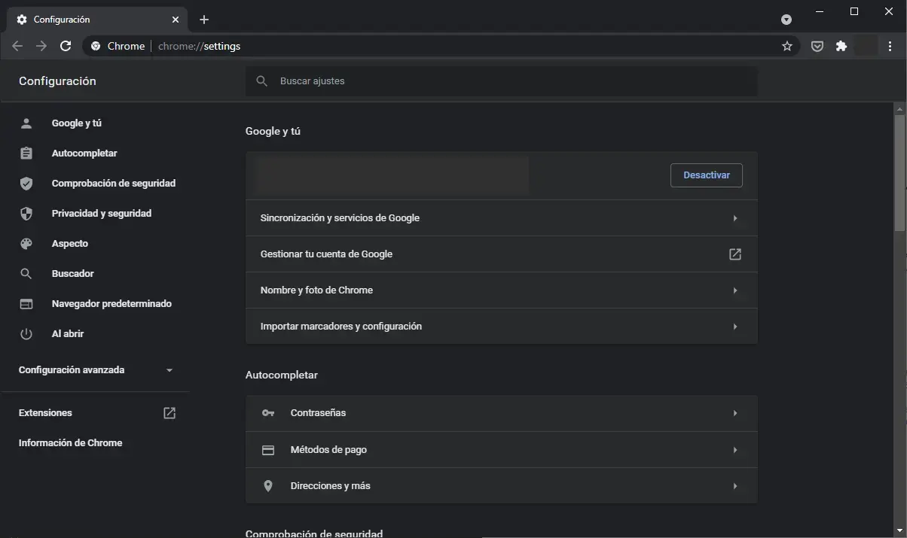
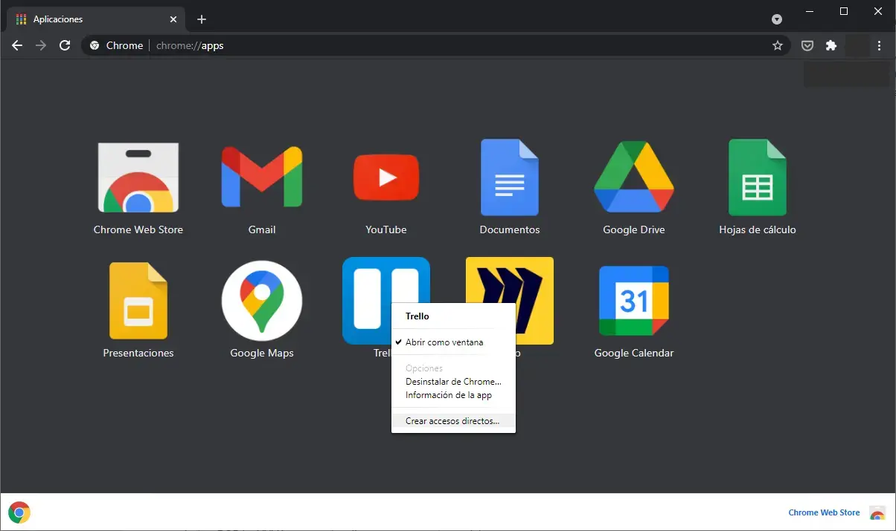
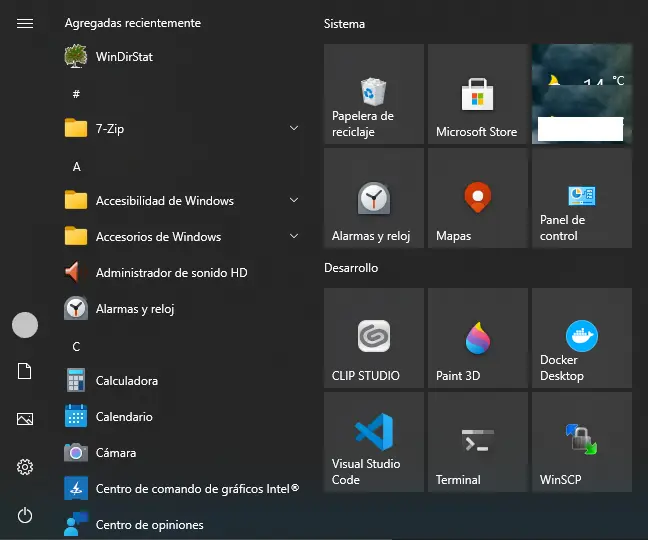
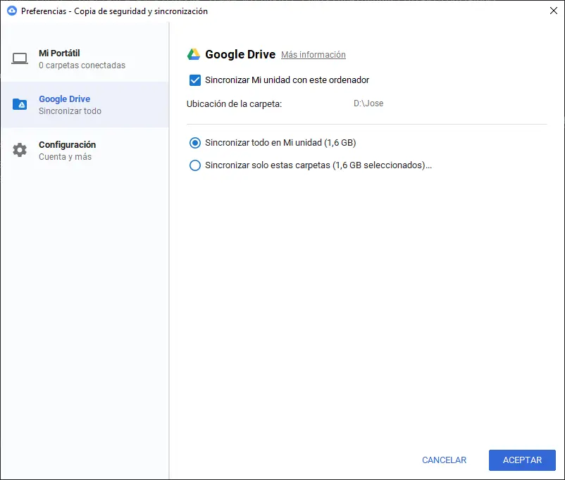

# Configuración para Windows

Lista de tareas para configurar una máquina Windows desde cero.

Inspirado en [dotfiles for Windows de Jay Harris](https://github.com/jayharris/dotfiles-windows) y [config de Mark Otto](https://github.com/mdo/config).

## Dependencias (Revisar)

Ejecutar en Powershell con privilegios de administrador.

- [Windows Terminal](https://www.microsoft.com/store/productId/9N0DX20HK701)
- [PowerShell](https://www.microsoft.com/store/productId/9MZ1SNWT0N5D)
- [Git](https://git-scm.com/)

```powershell
> .\Dependencies.ps1
```

- [Google Chrome](https://www.google.com/intl/es/chrome)
- [Google Drive](https://www.google.com/intl/es/drive/download/)
- [Visual Studio Code](https://code.visualstudio.com/)
- [Toggl](https://toggl.com/)
- [7-zip](https://www.7-zip.org/) ([7-zip ZS](https://mcmilk.de/projects/7-Zip-zstd/))
- [Discord](https://discord.com/)
- [Wacom drivers y CLIP Studio Paint](https://www.wacom.com/es-es)
- [Steam](https://store.steampowered.com/)

## Desarrollo en contenedores con Visual Studio Code

- [Desarrollo remoto con Visual Studio Code](https://code.visualstudio.com/docs/remote/remote-overview)
- [Docker Desktop WSL 2 backend](https://docs.docker.com/docker-for-windows/wsl/)
- [Windows Subsystem for Linux Installation Guide for Windows 10](https://docs.microsoft.com/en-us/windows/wsl/install-win10)

## Google Chrome

Activar la sincronización.



Crear accesos directos para las aplicaciones.





## Google Drive

Sincronizar en la carpeta de datos.



## Configuración de terminal

Configuración de terminal y de las utilidades que habitualmente se utilizan desde el terminal como, p. e., git.

Ejecutar en Powershell con privilegios de administrador. Crea accesos directos a los ficheros contenidos en el proyecto en las carpetas correspondientes.

```powershell
> .\Bootstrap.ps1
```

### Vim

Solo para el vim que viene con git para Windows, no quiero instalar vim aparte.

En git bash:

```bash
vim +PlugInstall +qall
```

## Futuros pasos

- [ ] Configuración para Linux

## Más referencias

- https://dotfiles.github.io/
- https://github.com/webpro/awesome-dotfiles